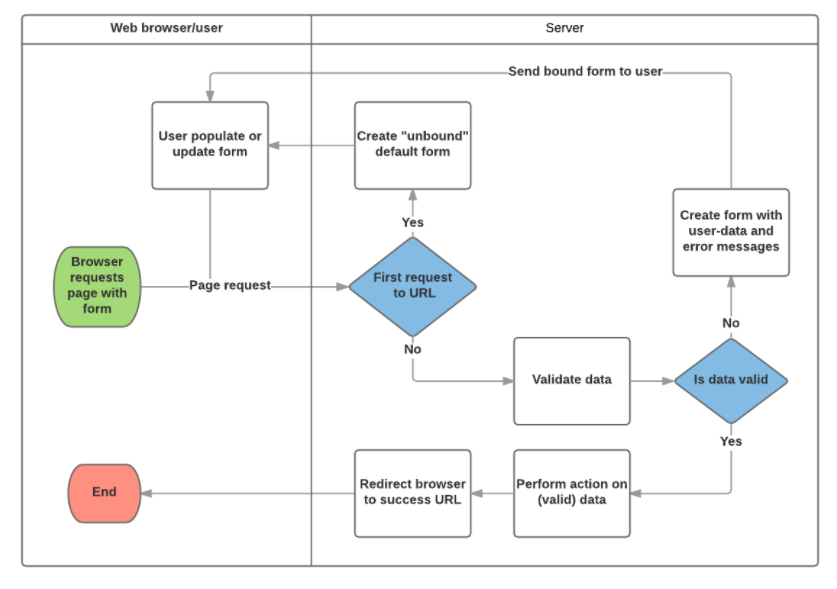

# Django Form Class


>  폼을 개밣는 것은 복잡한 작업이다. 폼을 위한 html을 작성해야하고, 서버로 입력된 데이터의 유효성도 검증해야하고, 또 적절하게 수정해야 하고. 유요하지 않은 입력에 대해선 에러 메세지와 함꼐 다시 표시해주어야 하며, 성공적으로 제출된 데이터는 적절히 처리하고 사용자가 이를 확인 할 수 있게 응답하도록 개발해야한다. 

Django 폼은 위의 단계중 많은 부분을 덜어내 줄 수 있다. 이 프레임워크는 폼과 그에 연관된 필드를 프로그램적으로 정의하여 객체를 만들고, 폼 html코드를 작성하는 작업과 데이터 유효성 검증과 사용자 상호작용에 이 객체들을 사용한다.


### HTML 폼?

- 폼은 HTML에선 적어도 한개 이상의 `type="submit"`인 input요소를 포함하는 `<form>...</form>`태그 사이의 요소들의 집합으로 정의된다.

- 폼은 가질 수 있는 입력요소와 관련 라벨의 갯수에는 제한이 없다.
- `submit`타입의 input태그는 보통 사용자가 누를 수 있는 버튼으로 표시되고, 이 버튼의 동작에 의해 폼의 다른 모든 input요소의 데이터가 서버로 업로드 된다. 
- **폼 속성으로는 데이터를 보내기 위해 사용되는 HTTP `method`와 서버상에서 데이터의 목적지를 `action`으로 정의한다!**
  - `action` : 폼이 제출(submit)될 떄 처리가 필요한 데이터를 전달받는 곳의 url 주소. 설정이 안되면 혹은 빈 문자열로 설정되면 폼은 현재 페이지 url로 다시 제출한다.
  - `method` : 데이터를 보내는데 사용되는 http 메소드 (post / get)
    - `post` 메소드는 사이트 간 요청 위조 공격에 좀 더 저항성이 좋게 만들 수 있기 때문에, 관련 데이터에 의해 서버 데이터베이스가 변경될 경우 항상 사용되어야 한다.
    - `get` 메소드는 사용자 데이터를 변경하지 않는 폼에서만 사용되어야 한다. url을 북마크 하길 원하거나 공유하기를 원하는 경우에 사용된다
- 서버의 역할은 첫번째로 필드를 비워두거나 초기값으로 채워두도록 초기 폼 상태를 표시하는 것이다. 사용자가 제출 버튼을 누른 후에, 서버는 웹 브라우저로부터 폼의 데이터를 넘겨받고, 데이터의 유효성을 검증해야한다. 폼이 유효하지 않은 데이터를 담고 있다면, 서버는 폼을 다시 표기해야하는데, 이번에는 사용자가 입력한 유효한 데이터는 그대로 표시하고, 유효하지 않는 필드만을 경고와 함께 표기해야 한다. 일단 모든 필드 의 데이터가 유효한 폼 데이터의 제출요청을 서버가 받게 되면, 서버는 적절한 동작을 수행하고 사용자에게 알려주게 된다.

### Django's form 처리 과정



1. 사용자가 처음으로 폼을 요청할때 기본 폼을 보여준다.
   - 폼은 비어있는 필드가 있을 수 있다. 채워져 있을 수도 있음
   - 이 시점의 폼은 유저가 입력한 값과 연관  X (unbound)

2. 제출 요청으로 부터 데이터를 수집하고 그것을 폼에 결합한다.
   - 데이터를 폼에 결합한다는 것은 사용자 입력 데이터와 유효성을 위한반 경우 에러메세지가 폼을 재표시할 필요가 되있을 때 준비되었다는 의미
3.  데이터를 다듬어서 유효성을 검증
   - 데이터를 다듬는 다는 것은 사용자 입력을 정화하고, python에서 사용하는 타입의 데이터로 변환하는것.
   - 유효성 검증은 입력된 값이 해당 필드에 저절한 값인지 검사
4. 유효하지 않는다 -> 폼을 다시 표기 . 이때 초기 값이 아니라 입력한 데이터와, 에러메세지를 표시
5. 유효하다 -> 요청된 동작을 수행 (데이터 저장, 이메일, 검색결과 반환...)
6. 모든 작업이 완료되면 새로운 페이지로 보낸다.


### Django's forms

- form은 Django프로젝트의 유효성 검사 도구 중 하나이며
- 공격 및 우연한 데이터 손상에 대한 중요한 방어 수단
- Django는 위와 같은 form 기능의 방대한 부분을 단순화하고 자동화 할 수 있으며, 프로그래머가 직접 작성한 코드보다 더 안전하게 수행하게 도와준다

- Django는 form에 관련된 작업의 아래 세부분을 처리해 준다.
  1. 렌더링을 위한 데이터 준비, 재구성
  2. 데이터에 대한 html forms생성
  3. 클라이언트로부터 받은 데이터 수신 및 처리

### The Django 'Form Class'

- Django Form 관리 시스템의 핵심
- form 내 field, field 배치, widget, label, 초기값, 에러메세지 등을 결정
- django는 사용자의 데이터를 받을 때 해야할 과중한 작업 ( 데이터 유효성 검증, 필요시 입력된 데이터 검증 결과 재출력, 유효한 데이터에 대해 요구되는 동작 수행 등)과 같은 반복 코드를 줄여준다.


### Form 작성하기

Form 클래스는 django form 관리 시스템의 핵심. form 클래스는 field들, field 배치, 디스플레이, widget, 라벨, 초기값, 유효한 값과 비유효 field에 관련된 에러 메세지를 결정한다. 


### Form 선언하기

form을 선언하는 문법은 model과 많이 닮았다. 같은 필드 타입을 사용하며 매개변수도 유하사다. 두가지 경우 모두 각 필드가 데이터에 맞는 타입인지 확인 할 필요가 있고, 각 필드가 보여주고 문서화할 description을 가진다는 것에서 form과 model이 유사한 문법으로 구성된다는 점을 납득할 수 있다.


- Form 데이터는 어플리케이션 디렉토리 안의 `forms.py`파일에 저장되어야 한다.
- form을 생성하기 위해 `form`클래스에서 파생된, `forms` 라이브러리를 import하고 폼 필드를 생성한다.

```python
from django import forms

class newForm(forms.Form):
    new_date = forms.DataField(help_text="도움문구")


```

- 대응되는 모델 필드와 유사성 때문에 많은 종류의 폼 필드가 있다.

  [`BooleanField`](https://docs.djangoproject.com/en/2.0/ref/forms/fields/#booleanfield), [`CharField`](https://docs.djangoproject.com/en/2.0/ref/forms/fields/#charfield), [`ChoiceField`](https://docs.djangoproject.com/en/2.0/ref/forms/fields/#choicefield), [`TypedChoiceField`](https://docs.djangoproject.com/en/2.0/ref/forms/fields/#typedchoicefield), [`DateField`](https://docs.djangoproject.com/en/2.0/ref/forms/fields/#datefield), [`DateTimeField`](https://docs.djangoproject.com/en/2.0/ref/forms/fields/#datetimefield), [`DecimalField`](https://docs.djangoproject.com/en/2.0/ref/forms/fields/#decimalfield), [`DurationField`](https://docs.djangoproject.com/en/2.0/ref/forms/fields/#durationfield), [`EmailField`](https://docs.djangoproject.com/en/2.0/ref/forms/fields/#emailfield), [`FileField`](https://docs.djangoproject.com/en/2.0/ref/forms/fields/#filefield), [`FilePathField`](https://docs.djangoproject.com/en/2.0/ref/forms/fields/#filepathfield), [`FloatField`](https://docs.djangoproject.com/en/2.0/ref/forms/fields/#floatfield), [`ImageField`](https://docs.djangoproject.com/en/2.0/ref/forms/fields/#imagefield), [`IntegerField`](https://docs.djangoproject.com/en/2.0/ref/forms/fields/#integerfield), [`GenericIPAddressField`](https://docs.djangoproject.com/en/2.0/ref/forms/fields/#genericipaddressfield), [`MultipleChoiceField`](https://docs.djangoproject.com/en/2.0/ref/forms/fields/#multiplechoicefield), [`TypedMultipleChoiceField`](https://docs.djangoproject.com/en/2.0/ref/forms/fields/#typedmultiplechoicefield), [`NullBooleanField`](https://docs.djangoproject.com/en/2.0/ref/forms/fields/#nullbooleanfield), [`RegexField`](https://docs.djangoproject.com/en/2.0/ref/forms/fields/#regexfield), [`SlugField`](https://docs.djangoproject.com/en/2.0/ref/forms/fields/#slugfield), [`TimeField`](https://docs.djangoproject.com/en/2.0/ref/forms/fields/#timefield), [`URLField`](https://docs.djangoproject.com/en/2.0/ref/forms/fields/#urlfield), [`UUIDField`](https://docs.djangoproject.com/en/2.0/ref/forms/fields/#uuidfield), [`ComboField`](https://docs.djangoproject.com/en/2.0/ref/forms/fields/#combofield), [`MultiValueField`](https://docs.djangoproject.com/en/2.0/ref/forms/fields/#multivaluefield), [`SplitDateTimeField`](https://docs.djangoproject.com/en/2.0/ref/forms/fields/#splitdatetimefield), [`ModelMultipleChoiceField`](https://docs.djangoproject.com/en/2.0/ref/forms/fields/#modelmultiplechoicefield), [`ModelChoiceField`](https://docs.djangoproject.com/en/2.0/ref/forms/fields/#modelchoicefield) .

- 대부분의 필드의 공통적 인자들
  - [required](https://docs.djangoproject.com/en/2.0/ref/forms/fields/#required): True로 설정하면 빈칸이나 None값을 줄 수 없다. 빈칸을 허용할라면 required=False로 두어야 함
  - [label](https://docs.djangoproject.com/en/2.0/ref/forms/fields/#label):  html에서 필드를 렌더링 할떄 사용하는레이블. 이를 지정해주지 않으면 django는 필드 이름에서 첫번쨰 문자를 대문자로, 밑줄을 공백으로 변경한 레이블을 생성한다.
  - [label_suffix](https://docs.djangoproject.com/en/2.0/ref/forms/fields/#label-suffix): 기본적으로, 콜론(:)이 레이블 다음에 표시된다. (예를 들면, Renewal date**:**). 이 인자는 다른 문자(들)를 포함한 접미사를 지정할 수 있도록 해준다.
  - [initial](https://docs.djangoproject.com/en/2.0/ref/forms/fields/#initial): 폼이 나타날 때 해당 필드의 초기 값.
  - [widget](https://docs.djangoproject.com/en/2.0/ref/forms/fields/#widget): 사용할 디스플레이 위젯.
  - [help_text](https://docs.djangoproject.com/en/2.0/ref/forms/fields/#help-text) (위의 예에서 봤듯이): 필드 사용법을 보여주는 추가적인 문구.
  - [error_messages](https://docs.djangoproject.com/en/2.0/ref/forms/fields/#error-messages): 해당 필드의 에러 메시지 목록. 필요하면 문구를 수정할 수 있다.
  - [validators](https://docs.djangoproject.com/en/2.0/ref/forms/fields/#validators): 해당 필드가 유효한 값을 가질 때 호출되는 함수의 목록.
  - [localize](https://docs.djangoproject.com/en/2.0/ref/forms/fields/#localize): 폼 데이타 입력의 현지화(localisation)를 허용함 (자세한 정보는 해당 링크 참조).
  - [disabled](https://docs.djangoproject.com/en/2.0/ref/forms/fields/#disabled): 이 옵션이 `True` 일때 해당 필드를 볼 수는 있지만 편집이 안됨. 기본 값은 `False`.

### 유효성 체크

django는 데이터 유효성을 체크할 수 있는 수많은 지점을 제공한다. 유효성을 체크하는 가장 쉬운 방법은 해당 필드의 `clean_<fieldname>()`메소드를 덮어쓰는 것.