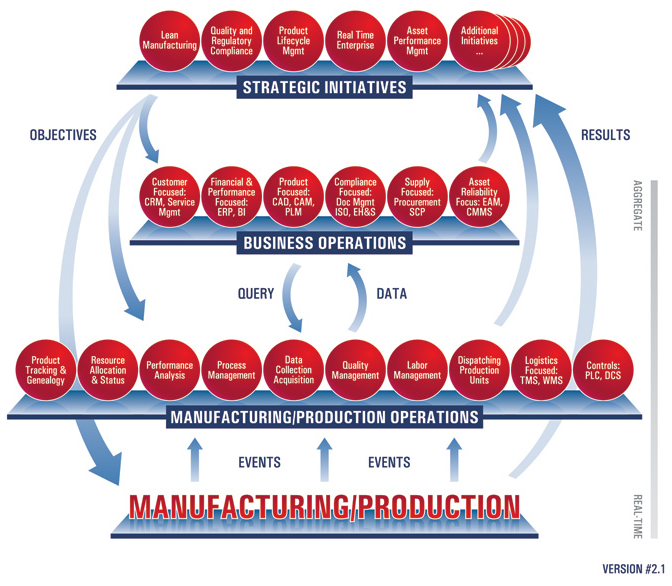
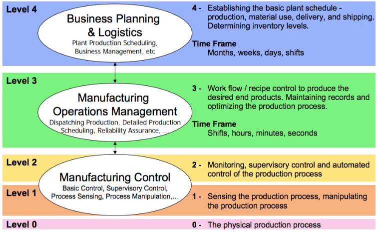

### MES

- mes(Manufacturing Execution System)은 생산 실행 시스템을 의미하는 약어이다

- 특정 제품을 생산하는 과정을 담당하는 시스템
- 제품 생산에 필요한 자재를 공장에 들여오고, 여러 과정을 거쳐 제품을 만들고, 출하하는 모든 과정을 MES로 관리할 수 있다
- 제품의 생산활동을 최적화 할 수 잇는 정보 관리 및 제어 시스템
- 장비 제어, 생산 제어, 분석 및 의사 결정 등의 기능을 갖음
- 자재, 설비, 작업 방법, 작업자를 통해 생산 정보를 수집하고, 이를 실시간으로 처리 및 공유
- 생산성 향상, 생산 사이클 단축, 설비 효율 향상 등을 목표로 함

### MES 참조 모델의 종류

#### 1.MESA 모델

> MES 협회인 MESA에서 개발. 해당 모델은 세 단계로 발전되어왔다.

##### 1997년 발표된 MESA-11 모델

: 해당 모델은 지극히 플랜트의 관점에서 설명된다

- 여기서 플랜트란, 생산 및 제조 과정을 수행하는 개별 설비나 공장을 의미

- MES의 11가지 요소

1. Operations/Detailed Sequencing

2. Dispatching production units (생산 단위 투입)

3. Product tracking and genealogy (생산 추적 및 이력)

4. Labour Management (노동 관리)

5. Quality Management (품질 관리)

6. Maintenance Management (유지 관리)

7. Resource allocation and status (자원 할당 및 상태)

8. Document control (문서 관리)

9. Performance Analysis (성능 분석)

10. Process Management (공정 관리)

11. Data collection and Acquisition (데이터 수집 및 획득)

**2004년 발표된 C-MES 모델**

: 단순히 플랜트의 관점을 넘어 여러 비즈니스 운영을 포함하는 개념의 모델

- Collaborative MES 즉, C-MES 모델이라 불림
- 가운데 큰 다각형 안에 있는 검은색 요소들이 기존의 MES 개념들을 다루고 있고, 다각형의 밖에는 7가지 새로운 요소들이 추가됨
- 기존의 설비 중심의 운영 활동에 국한되지 않고, 아래의 7가지 비즈니스 운영 영역과 상호작용하는 방식에 중점을 두고 있다.

1. 공급 중심 시스템 (SCP)

2. 고객 중심 시스템 (CRM 및 서비스 관리)

3. 재무 및 성과 중심 시스템 (ERP 및 BI 소프트웨어)

4. 제품 중심 시스템 (CAD, CAM, PLM)

5. 물류 중심 시스템 (TMS, WMS)
6. 컨트롤 (PLC, DCS)

7. 규정 준수 시스템 (ISO, EH&S)

**2008년 발표된 MESA 모델**

:마지막으로 2008년에는 이전 모델들에서 더욱 발전된 MESA 모델이 발표, 이 모델이 지금까지도 사용됨

- 모델의 가장 아래층은 Manufacturing/Production Operations 즉, 가장 초기 모델의 설비 중심 운영 개념

- 그 위에는 Business Operations라는 두 번째 모델에서 추가된 비즈니스 운영 개념

- 마지막으로 추가된 영역이 바로 Strategic Initiatives인데, 의역하자면 전략적 운용 정도

- 이는 아래와 같은 엔터프라이즈 차원의 의사 결정 요소를 담고 있습니다.

1. Lean Manufacturing (린 제조)

2. Quality and Regulatory Compliance (품질 및 규정 준수)

3. Product Lifecycle Management (제품 수명 주기 관리)

4. Real Time Enterprise (실시간 엔터프라이즈)

5. Asset Performance Management (자산 성과 관리) 등

 

#### 2.ANSI/ISA-95 모델

: 엔터프라이즈와 제어 시스템 간의 자동화 된 인터페이스를 개발하기위한 ISA (International Society of Automation)의 국제 표준 모델

- IEC 62264 국제 표준

 

**ANSI/ISA-95 모델**

- ANSI/ISA-95 모델은 비즈니스 프로세스에 중점을 두고 있는 MESA 모델과는 달리, 정보 아키텍처에 중점을 두고 있다.

- PERA (Purdue Enterprise Reference Architecture) 모델을 기반으로 생산 시스템을 다섯 단계로 나누고 있다.

| Level | 요소                                   |
| ----- | -------------------------------------- |
| 0     | 물리적인 생산 공정                     |
| 1     | 센서 등의 지능형 장치 (단위 제어 장치) |
| 2     | PLC, DCS, OCS 등의 공정 제어 시스템    |
| 3     | 생산 운영 관리 (MES)                   |
| 4     | ERP를 비롯한 엔터프라이즈 운영         |

(ANSI/ISA-95 모델의 각 레벨 별 요소)

- 여기에서 넓은 의미로는 Level 1~3을, 좁은 의미로는 Level 3을 MES라고 칭한다.

- 해당 모델은 Level 3인 생산 운영 관리와 Level 4인 엔터프라이즈 운영간의 상호 작용에 중점을 두고 있다.

- 이 ANSI/ISA-95 모델이 설명하고 있는 MES를 간단하게 개념화 해본다면,

1.  생산 공정을 엔터프라이즈 시스템과 연결하고,

2. work flow를 관리하여 최종 제품을 생산하고,

3. 생산 기록을 유지하며,

4. 생산 프로세스를 최적화함

 